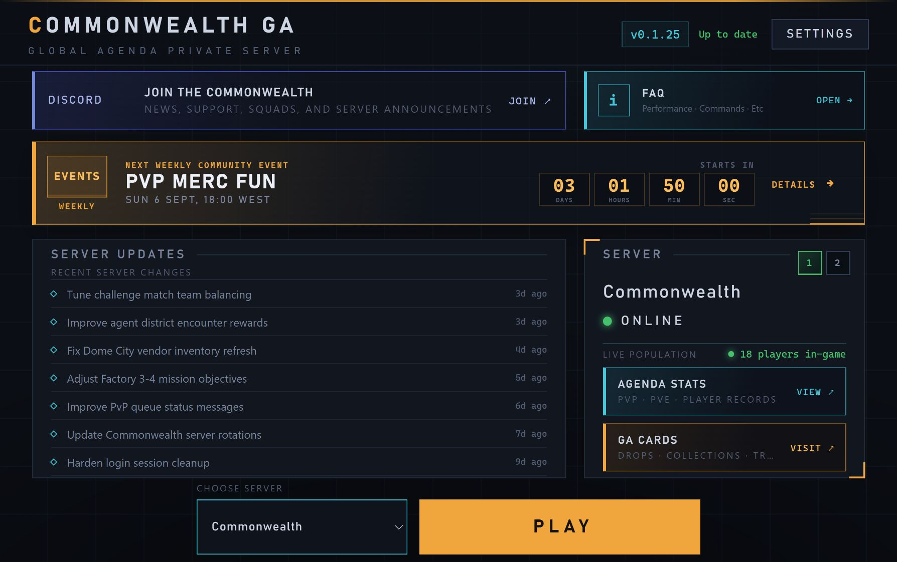
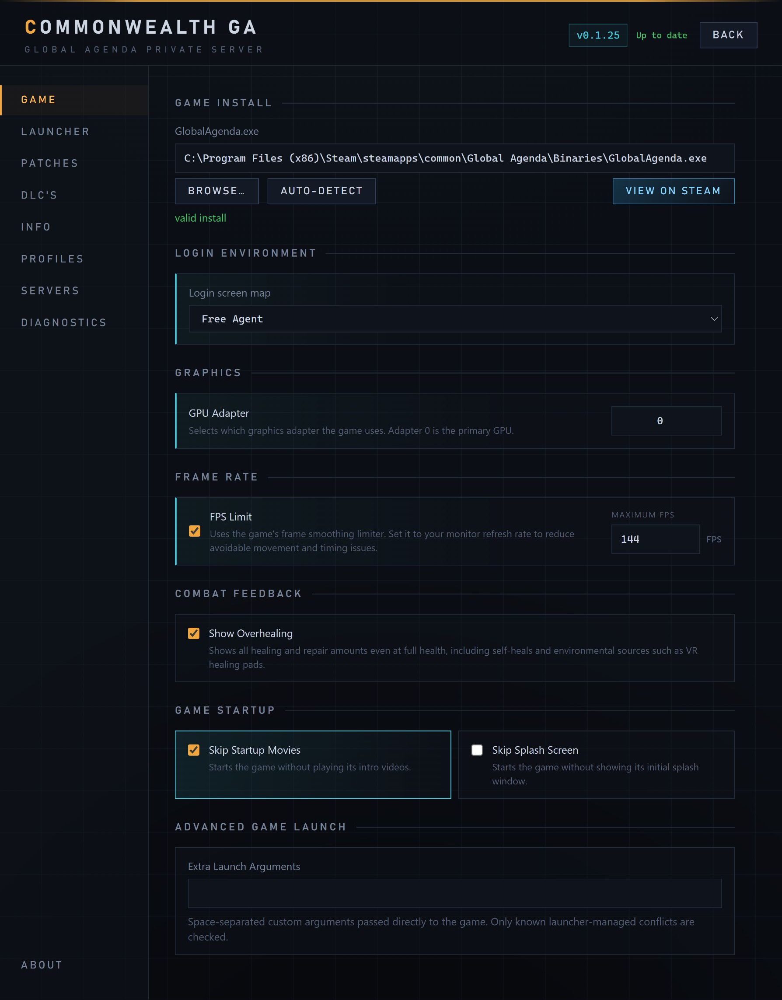
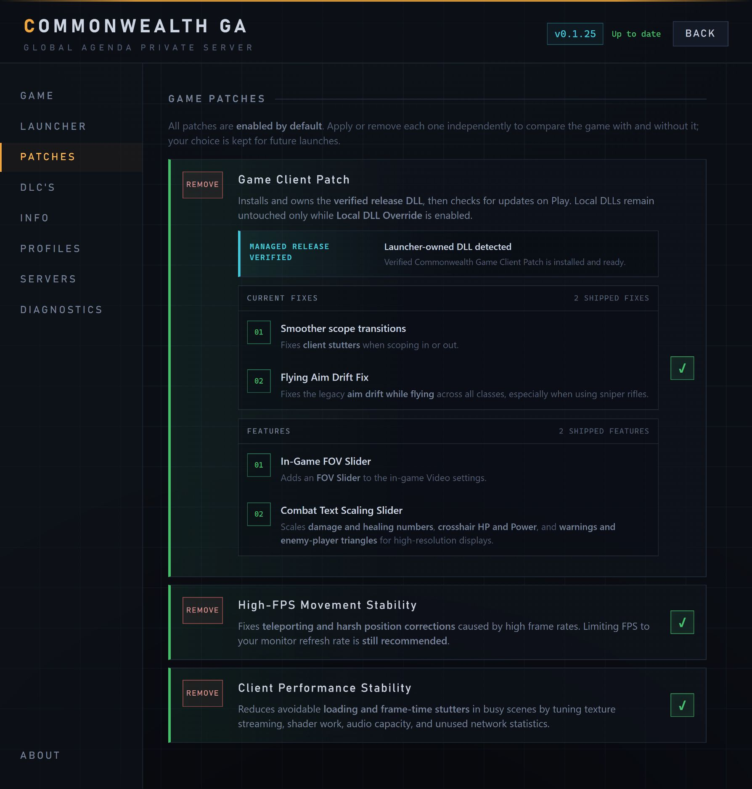
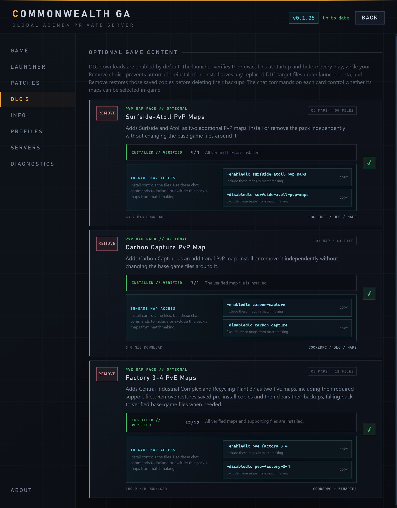
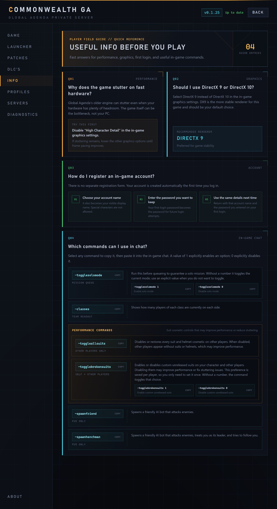
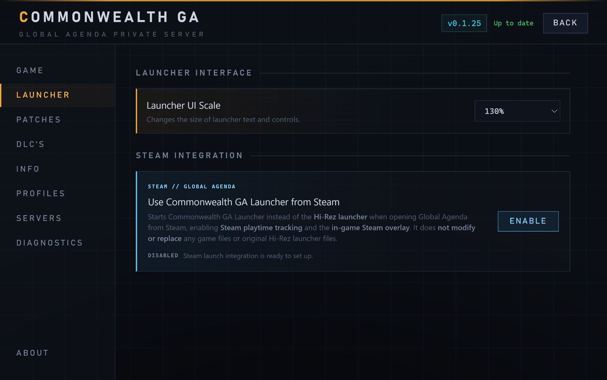

# Commonwealth GA — Global Agenda Private Server Launcher

A Windows and Linux launcher for Commonwealth, a Global Agenda private server hosted in
Europe (EU).

---

## Launcher Preview

<p align="center">
  <a href="images/launcher-main.jpg">
    
  </a>
  <br>
  <sub>Server health, community events, recent updates, resources, server choice, and Play in one view.</sub>
</p>

<details>
<summary><strong>View screenshots of the other launcher pages</strong></summary>

<br>

<table>
  <tr>
    <td width="50%" valign="top">
      <strong>Game setup</strong><br>
      <sub>Find the game and tune login, graphics, FPS, and startup settings.</sub><br><br>
      <a href="images/launcher-game-settings.jpg">
        
      </a>
    </td>
    <td width="50%" valign="top">
      <strong>Patches</strong><br>
      <sub>Apply verified client, stability, and performance fixes independently.</sub><br><br>
      <a href="images/launcher-patches.jpg">
        
      </a>
    </td>
  </tr>
  <tr>
    <td width="50%" valign="top">
      <strong>Optional content</strong><br>
      <sub>Install PvP and PvE maps and copy their matchmaking commands.</sub><br><br>
      <a href="images/launcher-dlcs.jpg">
        
      </a>
    </td>
    <td width="50%" valign="top">
      <strong>Player guide</strong><br>
      <sub>Quick answers for performance, graphics, first login, and in-game commands.</sub><br><br>
      <a href="images/launcher-player-guide.jpg">
        
      </a>
    </td>
  </tr>
  <tr>
    <td colspan="2" valign="top">
      <strong>Launcher and Steam integration</strong><br>
      <sub>Keep Steam playtime tracking and the in-game overlay without modifying game or original Hi-Rez launcher files.</sub><br><br>
      <a href="images/launcher-steam-integration.jpg">
        
      </a>
    </td>
  </tr>
</table>

</details>

---

## Download and Install

For a fresh game installation, close this launcher and start Global Agenda normally from Steam
once. Reach the login screen, close the game, then reopen this launcher.

### Windows

**[Download the latest Windows installer](../../releases/latest/download/Commonwealth-GA-Launcher-Windows-x64-Setup.exe)**

1. Run the installer.
2. Open the launcher.
3. Select your game installation, or let the launcher find it.
4. Press **Play**.

### Linux

**[Download the latest Linux AppImage](../../releases/latest/download/Commonwealth-GA-Launcher-Linux-x64.AppImage)**

Allow the AppImage to run, open it, and follow the setup instructions.

The launcher supports installed Wine runners and Proton through UMU. Linux users can also wrap
the launch with tools such as Gamescope, `taskset`, and custom environment options.

The launcher updates itself automatically.

---

## Features

- Automatic updates
- Easy game setup and one-click launching
- Optional Steam integration that starts the Commonwealth launcher instead of the Hi-Rez launcher
  from Steam, enabling Steam playtime tracking and the in-game overlay without modifying or
  replacing any game files or original Hi-Rez launcher files
- Live server status and selection, with Commonwealth updates, player count, Agenda Stats, and
  GA CARDS access
- A prominent local-time countdown for Commonwealth's weekly PvP events, with event details, PvP
  Day summaries, and optional Windows or Linux system reminders that work while the launcher is closed;
  clicking one opens the launcher, or Global Agenda through Steam when Steam integration is enabled
- Compact, non-blocking notifications for launcher feedback
- Built-in interface recovery if the launcher UI stops unexpectedly
- Up to five optional profiles for quickly switching game settings, with one clearly marked active choice, exact before/after comparisons, and save protection
- One-click performance and stability patches
- An optional Game Client Patch with:
    - Smoother scope transitions
    - Fixed aim drift while flying across all classes, especially with sniper rifles
    - An FOV Slider in the in-game Video Settings
    - A Combat Text Scaling Slider for high-resolution displays
- Optional PvP and PvE map packs with simple install, remove, and matchmaking controls
- Useful game, graphics, and launch options in one place
- Performance tips, account help, and copyable in-game commands
- Direct Discord access and built-in diagnostics
- Windows and Linux support through Wine or Proton, including Gamescope and custom launch commands

---

## Developers

<details>
<summary>Development and release information</summary>

Node.js 22.12 or newer is required.

```bash
npm ci
npx --no-install install-electron --no
npm run dev
npm run typecheck
npm run build
```

Create local packages with `npm run dist:win` or `npm run dist:linux`. Build output is written to
`out/`; installers and AppImages are written to `dist/`. Local development uses the generated
`out/` files, keeps its settings separate from installed builds, and does not check online release
channels.

Developer Mode can validate and use a local 32-bit x86 client patch DLL. Local DLLs remain
developer-owned while Local DLL Override is enabled. With the override off, pressing Play restores
the saved managed-patch choice by replacing or removing the client DLL.

Developer Mode can also enable the full in-game console with a selectable activation key.

The former experimental DXVK/Vulkan option remains visible but disabled. Existing
launcher-managed DXVK installations are removed automatically.

Public launcher settings are stored in `launcher.config.yml`.

Run the **Release launcher** workflow from the stable branch to publish both platforms. The
workflow calculates and publishes the next launcher version automatically.

</details>
